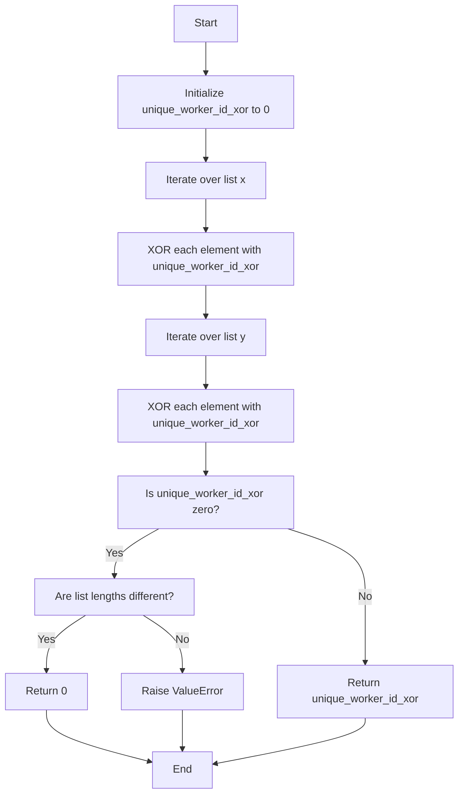

# Skipping Work Challenge in Google Foobar

## The Problem
Commander Lambda needs you to sort out a mess with her workers' shifts. Some bunnies have been moved to other areas, and now their shift schedules are all mixed up. Sorting this out by hand would take ages. So, you're here to find a quicker way to do it.

## The Task
Write a function called `solution(x, y)`. This function will take two lists, `x` and `y`. Both lists have worker IDs, but one list has an extra ID that the other doesn't. Your job is to find this extra ID and return it.

## The Rules
- You'll get two lists, `x` and `y`. They're almost the same but one has an extra ID.
- Both lists have at least 1 and at most 99 IDs.
- The IDs can be the same in each list, but they might be in a different order.
- All IDs are between -1000 and 1000, just like Commander Lambda likes it.

That's it! Your function should be quick and return the extra ID, see original [challenge file `readme.txt`](readme.txt) for reference.

## Language
- I have provided a Python solution, see `solution.py`.

## Problem Specification: Worker Shift Anomalies

| Topic | Details |
|-------|---------|
| **Objective** | Commander Lambda wants to fix the labor shifts that have gotten mixed up. Some bunny workers have been transferred and are not available for their shifts. The task is to efficiently identify these workers. |
| **Function Signature** | Write a function `solution(x, y)` that takes two lists of worker IDs and returns the additional ID present in one of the lists. |
| **Input** | Two almost identical lists `x` and `y` containing worker IDs. One of the lists contains an additional unique ID. |
| **Output** | Return the additional unique ID. |
| **Constraints** | - Lists will contain \( n \) integers, where \( n \) is at least 1 but never more than 99, and one of the lists will contain an additional unique integer.   - Worker ID will be between -1000 and 1000.   - The order of elements in the lists should not affect the functionality of your solution.   - Function must perform efficiently within the size constraints of the lists, which can have up to 100 elements. |

### Python Cases

`solution.py` code should pass the following test cases.

| Input | Output |
|-------|--------|
| `solution.solution([14, 27, 1, 4, 2, 50, 3, 1], [2, 4, -4, 3, 1, 1, 14, 27, 50])` | -4 |
| `solution.solution([13, 5, 6, 2, 5], [5, 2, 5, 13])` | 6 |

#### Expanded Coverage for Python Cases

These cases have been carefully selected to test the function across a range of potential hidden unit test case scenarios:

| Input | Output | Scenario |
|-------|--------|----------|
| `solution([13, 5, 6, 2, 5], [5, 2, 5, 13])` | 6 | Typical positive cases |
| `solution([14, 27, 1, 4, 2, 50, 3, 1], [2, 4, -4, 3, 1, 1, 14, 27, 50])` | -4 | Typical negative cases |
| `solution([-1000], [-1000, 1000])` | 1000 | Positive boundary values |
| `solution([1000], [-1000, 1000])` | -1000 | Negative boundary values |
| `solution([1, 2, 3], [3, 2, 1, 0])` | 0 | Unique number is zero |
| `solution([0, 0, 0], [0, 0])` | 0 | All elements are zero |

Use `verify solution.py` to test your solution and see how it does. When you are finished editing your code, use `submit [file]` to submit your answer.

## Constraints for Python
- Your code will run inside a Python 2.7.13 sandbox.
- All tests will be run by calling the `solution()` function.
- Standard libraries are supported except for a few [listed in the original `constriaints.txt` file](constraints.txt).
- Input/output operations are not allowed.
- Your solution must be under 32,000 characters in length.

---

## `solution.py` Documentation

### Overview
This file contains the solution to the "Skipping Work" challenge. It aims to identify the Worker ID of the worker who is skipping work. The solution employs bitwise XOR for an efficient O(n) time complexity and O(1) space complexity.

### Solution Flow

---

## Functions

### `solution(x: List[int], y: List[int]) -> int`

#### Description
- **Objective**: Identifies the unique Worker ID present in either list `x` or `y`.
- **Input**: Two almost identical lists `x` and `y` containing Worker IDs. One of the lists contains an additional unique ID.
- **Output**: Returns the additional unique ID.
- **Time Complexity**: O(n)
- **Space Complexity**: O(1)

#### Core Logic
- Uses bitwise XOR to find the unique ID.

### `test_solution()`

#### Description
- **Objective**: Conducts unit tests on the `solution()` function using a variety of scenarios.
- **Raises**: AssertionError if any of the test cases fail.
- **Returns**: None

#### Test Cases
- **Typical Scenarios**: Tests with both positive and negative numbers.
- **Boundary Conditions**: Tests with extreme values within the given constraints.
- **Edge Cases**: Tests with zeros and special configurations.
- **ValueError Integrity**: Tests for identical lists.

## Main Execution
- Calls `test_solution()` if the script is run as the main program.

---

## License
This project is licensed under MPL 2.0.

(<a href="#readme-top">back to top</a>)

